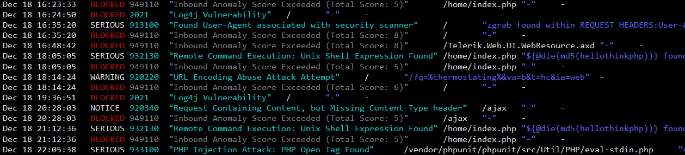

# pamsel
parsing modsecurity logfiles

	
[ModSecurity](https://github.com/SpiderLabs/ModSecurity) - together with the [OWASP core rules](https://owasp.org/www-project-modsecurity-core-rule-set/) - is a powerful web application firewall (WAF)
It protects your server against a wide range of HTTP-attacks. (SQL injection, cross-site scripting etc.)

However ModSecurity (like any WAF) produces sometimes false positives.
To eliminate these, you need to tune your configuration and add rule exclusions. (Whitelisting)

It can be a frustrating and time consuming process to inspect the logfiles.
pamsel is a small tool that might help you a bit with this.

sample output:

last changes:

22.12.2021: colored output now only to console (escape sequences are unwanted if output is redirected or piped)
